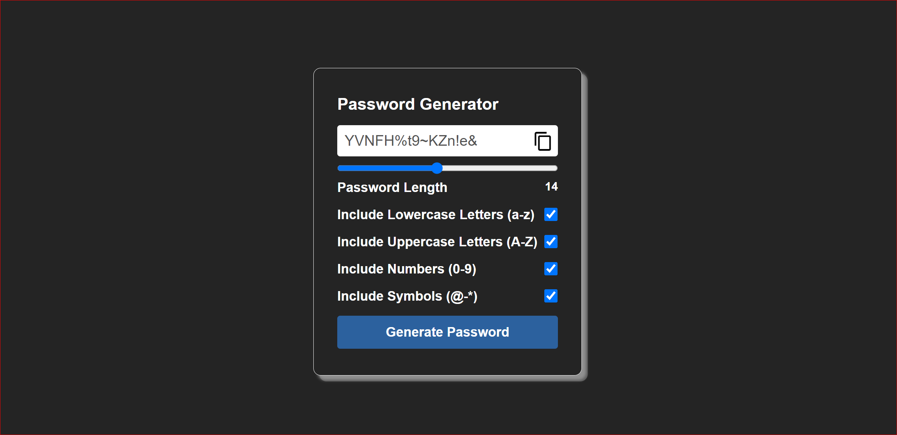

# Password Generator

This is a simple yet effective password generator built using HTML, CSS, and JavaScript. It allows users to create strong and secure passwords with customizable options.

## Features

- **Password Length**: Adjust the length of the password using a slider.
- **Character Options**: Include or exclude lowercase letters, uppercase letters, numbers, and symbols.
- **Clipboard Copy**: Easily copy the generated password to the clipboard with a single click.
- **Responsive Design**: The interface is responsive and works well on different screen sizes.

## Screenshot

